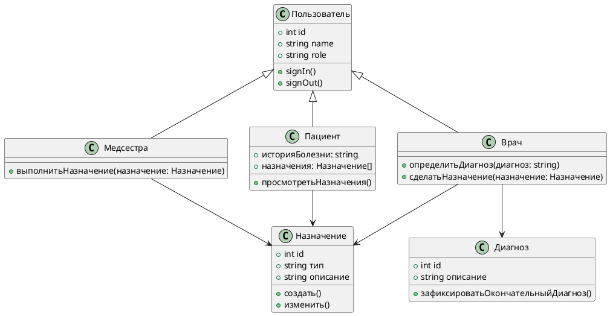
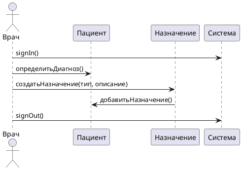
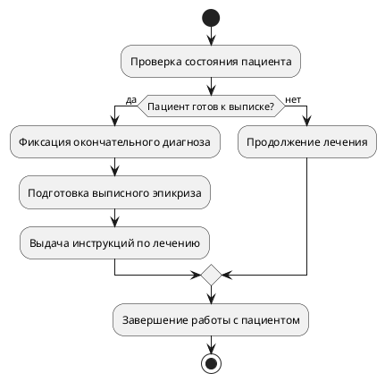
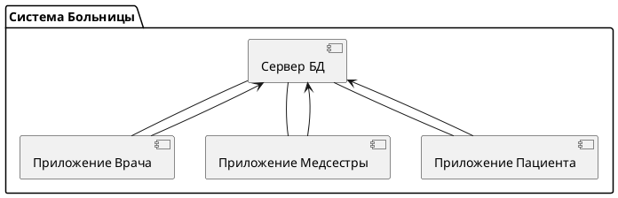

[plantuml.com](https://plantuml.com/ru/)

```plantuml
@startuml
actor Врач
actor Пациент
actor Медсестра

usecase "Sign In" as SignIn
usecase "Sign Out" as SignOut
usecase "Регистрация" as Registration
usecase "Просмотр информации" as ViewInfo
usecase "Добавление информации" as AddInfo
usecase "Модификация информации" as ModifyInfo
usecase "Удаление информации" as DeleteInfo
usecase "Определение диагноза" as Diagnose
usecase "Создание назначения" as Prescription
usecase "Выполнение назначения" as ExecutePrescription
usecase "Выписка пациента" as Discharge

Врач --> SignIn
Врач --> SignOut
Врач --> ViewInfo
Врач --> AddInfo
Врач --> Diagnose
Врач --> Prescription
Врач --> ModifyInfo
Врач --> DeleteInfo
Врач --> Discharge

Медсестра --> SignIn
Медсестра --> SignOut
Медсестра --> ViewInfo
Медсестра --> ExecutePrescription

Пациент --> SignIn
Пациент --> SignOut
Пациент --> Registration
Пациент --> ViewInfo

@enduml
```

1. Диаграмма вариантов использования (Use Case Diagram)

2. Диаграмма классов (Class Diagram)

3. Диаграмма последовательности (Sequence Diagram)
   Для примера возьмем процесс "Сделать назначение" врачом.

4. Диаграмма деятельности (Activity Diagram)
   Диаграмма для процесса "Выписка пациента".

5. Диаграмма компонентов (Component Diagram)

